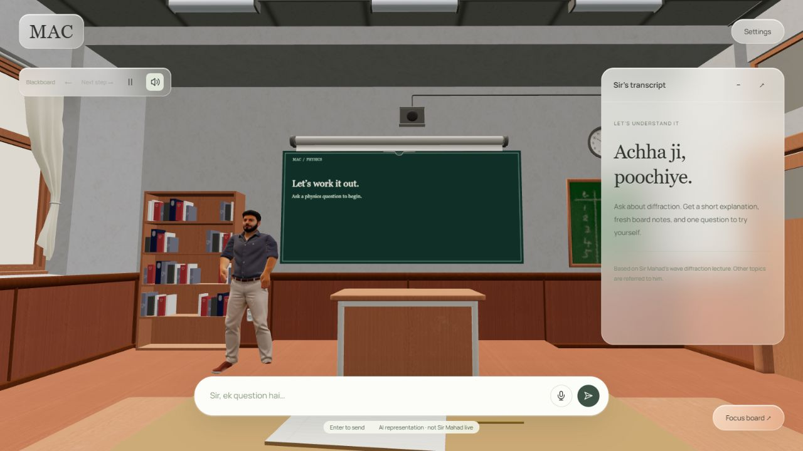

# Sir Mahad’s Physics Stand-In

A local web classroom for O Level / IGCSE wave diffraction. Sit at the front desk, ask a question, and get generated board notes, timestamped lecture evidence, and one comprehension check. **This is an AI representation, not Sir Mahad speaking live.** The persona remains a project draft until his approval is recorded.



## Run

Requires Node.js 22+. Teaching requires a running Ollama service and a downloaded model. Speech engines are optional; the classroom and text input load without them.

```sh
npm ci
ollama pull qwen2.5:3b
```

Set `OLLAMA_MODEL=qwen2.5:3b` in your shell, or put `qwen2.5:3b` in `runtime/ollama-model.txt`. Without configuration the existing backend selects `qwen2.5:0.5b`.

```sh
npm start
```

Open [http://127.0.0.1:4317](http://127.0.0.1:4317). **Settings → Teacher connection** shows model, speech, and transcription availability. See [SETUP.md](SETUP.md) for platform setup. Environment variables are not automatically loaded from `.env`; Node 22 can load one with `node --env-file=.env server.mjs`.

For server speech install eSpeak NG. For microphone transcription install Python 3.10+ and `pip install -r requirements.txt`, then configure `WHISPER_PYTHON` or `runtime/python-path.txt`. Speech models need an initial download. A local Ollama model uses no paid API; an optional cloud model is subject to its provider’s network and account requirements.

## Classroom controls

- Type a question or record WAV microphone input; review the transcription before sending.
- Use **Focus board** to move the view closer. Previous/next steps switch to manual board progression.
- Use **Answer check**, **Small hint**, or **Explain another way** to continue the lesson with explicit context.
- Enable spoken answers or select **Read aloud**. Stop interrupts narration and lets the teacher return to his starting position.
- Settings controls speaking pace, quiet procedural footsteps/send cues, and optional room tone. Ambience defaults off, ducks during speech, and stops during recording or when the page is hidden.
- The last lesson and a bounded notebook stay in this browser; reloading never starts narration automatically.

The supplied teacher is a rigged 3D character with walking, turns, pointing, and laughing clips. It has no facial speech rig; narration drives body choreography rather than accurate lip sync. eSpeak or an installed device voice is synthetic, not Sir Mahad’s cloned voice.

## Backend integration

This classroom integrates with the teammate’s backend from commit `87f0c32`. Its `backend/`, `server.mjs`, `teacher/`, `skills/`, `syllabus/`, and dependencies are preserved. No ElevenLabs credentials or previous agent implementation are required.

1. `teacher/AGENT.md` supplies the standing identity and rules.
2. `syllabus/index.json` and chapter indexes select the topic; `skills/index.json` selects teaching instructions.
3. The backend ranks only relevant passages from `data/passages.json` and loads its shared device student context under `runtime/student/`.
4. Ollama produces fresh lesson JSON. The backend validates source IDs and bounds diagrams.
5. `public/api-contract.js` adapts the API response for the classroom and derives YouTube timestamps from the known corpus, never from model-created URLs.

The server uses **one shared student profile per device**, not authenticated separate accounts. Browser notebooks do not establish student isolation. `public/request-context.js` adds bounded context only for explicit follow-ups/check attempts because this backend does not include its stored conversation history in the model messages.

Other topics, insufficient/conflicting evidence, and personal judgement are referred to Sir Mahad. Referrals are saved locally for manual review; nothing is automatically messaged to him. Lecture passages are corrected project paraphrases with original transcript segments and correction notes, not signed teacher-approved notes. Generated explanations still need factual review.

## Verification

```sh
npm test
```

Tests cover source adapters, retrieval, safe boards, animation routes/turns/pause/return, frame caps, sound lifecycle, voice cancellation/device fallback, WAV capture/resampling, browser notebook bounds, and explicit follow-up context. They do not establish a model’s teaching accuracy or substitute for a human microphone/speaker check.

[Integration notes](docs/integration.md) record provider availability and known backend limitations. [Classroom assets](docs/classroom-assets.md) documents the supplied character and room. [Polish plan](docs/polish-plan.md) contains the earlier implementation and verification history.

## Git hygiene

`runtime/`, `.env`, `.venv/`, model downloads, raw personal persona notes/transcripts, and `node_modules/` are ignored. Student records and provider keys stay out of Git. Converted classroom assets ship with the UI; original uploaded archives remain outside the app.
